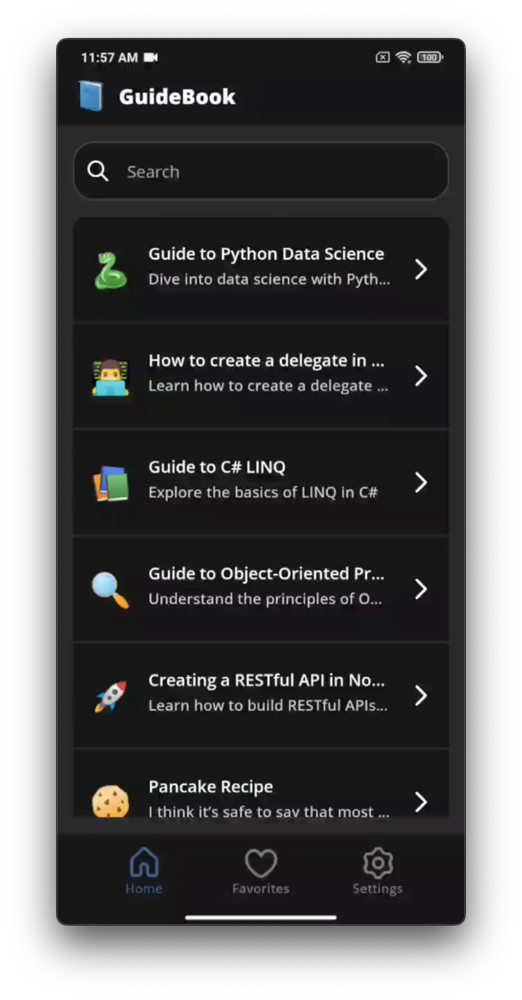
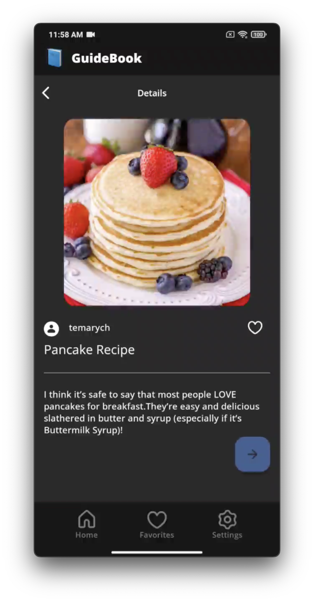
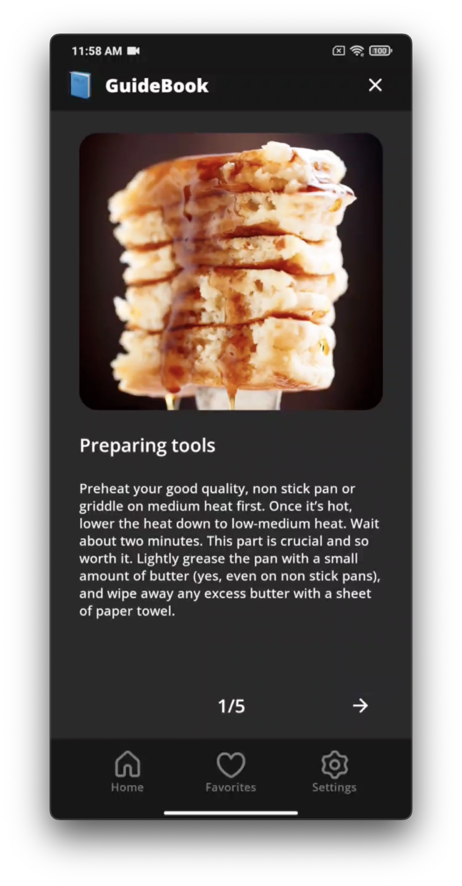

# GuideBook - Android App


## Screenshots

<div style="display: flex; justify-content: space-between;">
    
    
    
</div>

## Table of Contents

- [Introduction](#introduction)
- [Key Features](#key-features)
- [Getting Started](#getting-started)
  - [Installation](#installation)
  - [Usage](#usage)
- [Contributing](#contributing)
- [License](#license)
- [Acknowledgments](#acknowledgments)

## Introduction

GuideBook is a feature-rich Android app that allows users to explore, view, and favorite guides. It offers a user-friendly interface, smooth navigation, and essential travel information in one place. This README provides an overview of the app, installation instructions, and how to get started.

## Key Features

- Browse and view travel guides.
- Mark guides as favorites.
- User-friendly and intuitive interface.
- Rich multimedia content.

## Getting Started

Follow these instructions to get a copy of the project up and running on your local machine for development and testing purposes.

### Installation

1. Clone the repository to your local machine using Git:

```shell
 git clone https://github.com/yourusername/guidebook-android.git
```

2. Open the project in Android Studio.
3. Build and run the app on the Android Emulator or a physical device.

## Usage
1. Launch the GuideBook app on your Android device or emulator.
2. Explore the list of available guides.
3. Tap on a guide to view its details.
4. To mark a guide as a favorite, tap the heart icon.
5. Use the navigation features to browse guides and discover steps for them.

## Tools
- Jetpack Compose - The Android Jetpack components used to build the app's user interface.
- Retrofit - Used for making network requests.
- RestAPI - is made for fetching requests.

## Contributing

We welcome contributions from the community. If you'd like to contribute to the project, please follow our Contributing Guidelines.

## License

This project is licensed under the MIT License - see the LICENSE file for details.
